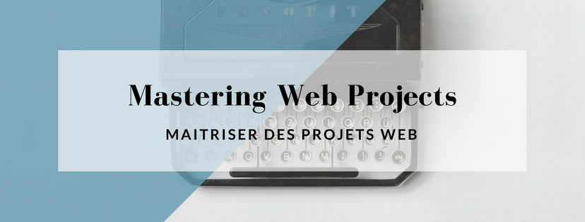
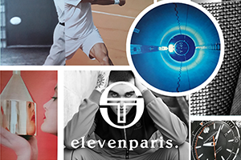

 
<html>
	<title> MWP Portfolio</title>
	
<body>
	<h1> Gestion de projets </h1>
	<h2> Cahier des charges fonctionnel <a href="doc/CDCF ST.pdf">CDCF </a></h2>
	<h1> Développement web </h1>
	<h2> Site responsive <a href="http://msacilotto.iesanetwork.fr/shareli">ShareLi (voir le site)</a></h2> 
	<h2> Site CMS <a href="http://charmhotels.iesanetwork.fr">Charm'Hotels (voir le site)</a></h2> 
	<h1> Community Management </h1>
	<h2> Stratégie de communication <a href="doc/lindt.pdf"> Lindt (voir le doc) </a></h2>
	<h2> Veille sur le travail digital <a href="https://www.facebook.com/ShareMWP/"> @ShareMWP (voir la page FB) </a></h2>
	<h1> Webmarketing </h1>
	<h2> Stratégie de webmarketing <a href="doc/webmarketing.pdf"> XHelio (voir le doc)</a></h2>
</body>

</html>
